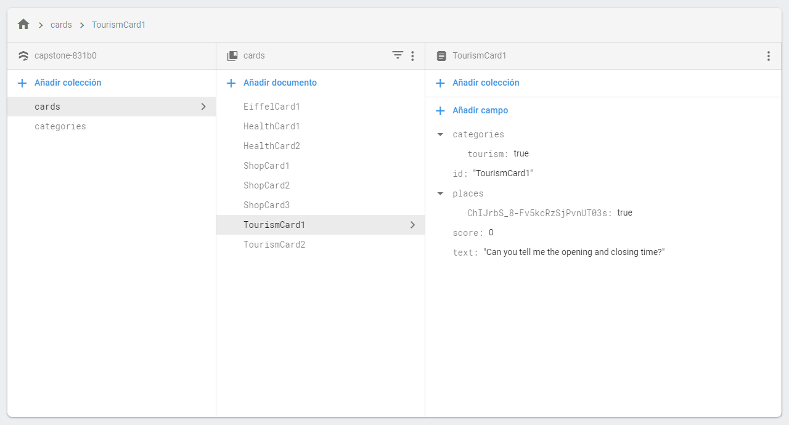
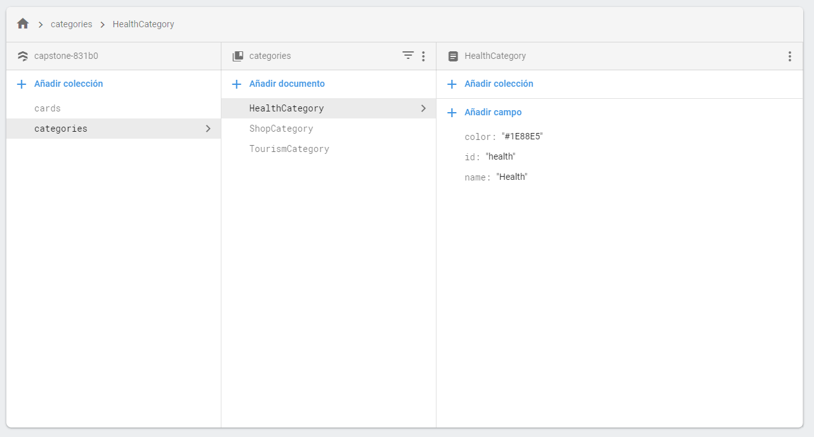

# Capstone

## Requirements

1. Open the `AndroidManifest.xml` file and write your api key from `Google Maps` with the following format:

```xml
<!-- Places SDK api key -->
<meta-data
    android:name="com.google.android.geo.API_KEY"
    android:value="<maps_api_key>" />
```

2. Create a new firebase proyect and replace the `app/google-services.json` file with the one that you can download from the firebase console.

3. Setup a new `firestore` database and make sure your collections follow the same structure as the one from the following images.

---




